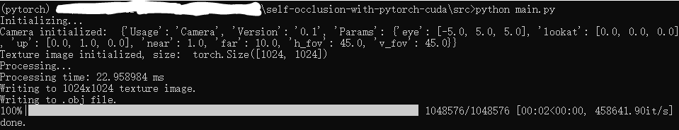
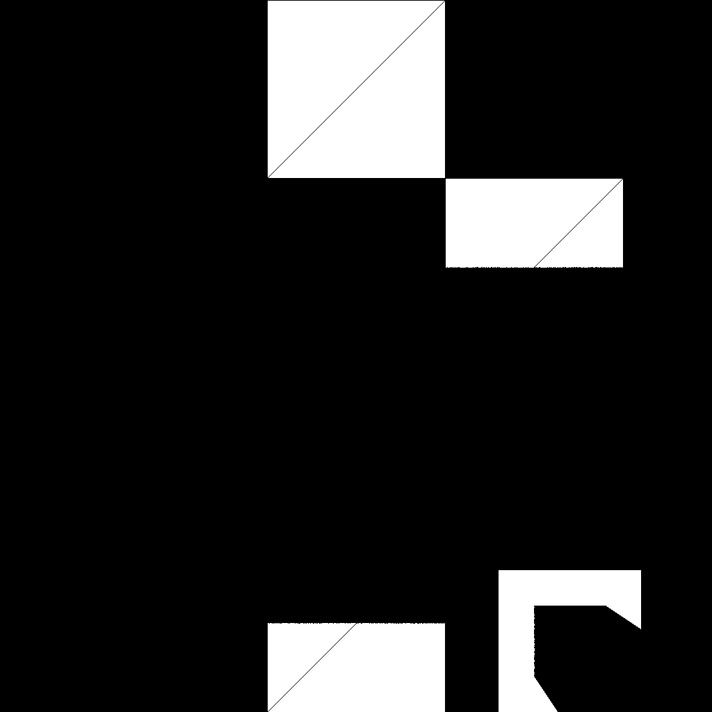

# Self Occlusion with Pytorch and CUDA

This is a project showing an object's self occlusion (relative to the camera/view position) results on a 1024x1024 texture.

## Installation

First install NVIDIA [CUDA](https://developer.nvidia.com/cuda-downloads), [cuDNN](https://developer.nvidia.com/cudnn), Python([Official site](https://www.python.org/), or [Anaconda](https://www.anaconda.com/)), and [python-pip](https://pypi.org/project/pip/).

### 1. Python environment

Here I recommend using a [virtualenv](https://docs.python.org/3/tutorial/venv.html) or a [conda-env](https://docs.conda.io/projects/conda/en/latest/user-guide/tasks/manage-environments.html) to install the following requirements. 

```shell
pip install -r requirements.txt
```

The project is tested with Python 3.7.6, CUDA nvcc 10.1, Pytorch 1.7.1 on Windows 10.

### 2. Build with CUDA

Go to `src/cpp/texture_mapping/` and execute:

```shell
python setup.py install
```

Go to `src/cpp/occlusion_detection/` and execute:

```shell
python setup.py install
```

**Note**: If you are using windows, there may be errors and some source codes from PyTorch may need to be modified manually. References: [site1 · GitHub](https://github.com/pytorch/pytorch/issues/55266), [site2 · GitHub](https://github.com/pytorch/pytorch/issues/43480), [site3(in Chinese)](https://zhuanlan.zhihu.com/p/340973730), [site4(in Chinese)](https://blog.csdn.net/weixin_41943311/article/details/118082017)

### 3. Set variables

You can set your own camera and object (currently only supports .obj file) attributes in `data/` folder.

#### Camera Attributes

```
eye: 	Camera position in the world coordinate.
lookat:	The point the camera is looking at in the world coordinate.
up:		The up direction of the camera in the world coordinate.
near:	The Near plane of the camera.
far:	The Far plane of the camera.
h_fov:	Horizontal field of view (Degree).
v_fov:	Vertical field of view (Degree).
```

### 4. Run

Make an output folder (currently it is set to `temp/` in `src/main.py`, you can modify it in the code).

Go to the root folder, and execute:

```shell
mkdir temp
```

Go to `src/` folder, and execute:

```shell
python main.py
```

### 5. Results

Results are saved in `temp/`, including an texture image and an obj file, both showing visible vertices.

#### Results example

The given object in this repo looks like this:


Run the commands in section 4 above, the console/terminal will show something like this:



View from (-5, 5, 5)

(1) Default parameters given in this repo:



(2) Set camera's near plane to 7.2, far plane to 8.6, and `v_fov` to 10 degree:

